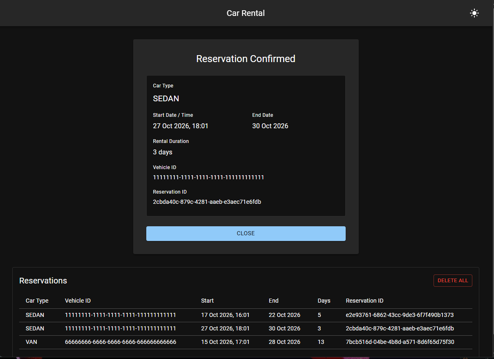

# Car Rental


## Backend
- Java 25
- Maven, or the included Maven Wrapper
```bash
cd backend 
mvn spring-boot:run or .\mvnw.cmd spring-boot:run
```
- http://localhost:8080

## Frontend
```bash
cd frontend
npm install
npm run dev
```
- http://localhost:5173



## Availability API
### Get Availability
GET http://localhost:5173/api/availability?carType=SEDAN&startDateTime=2026-10-16T15%3A22&endDate=2026-10-30

{
    "startDateTime": "2026-10-16T15:22:00",
    "endDate": "2026-10-30",
    "numberOfDays": 14,
    "availableVehicles": [
            {
            "id": "11111111-1111-1111-1111-111111111111",
            "carType": "SEDAN"
            },
            {
            "id": "22222222-2222-2222-2222-222222222222",
            "carType": "SEDAN"
            },
            {
            "id": "33333333-3333-3333-3333-333333333333",
            "carType": "SEDAN"
            }
        ]
}

## Reserver API
### POST Reservation
POST http://localhost:5173/api/reservations
#### Request
{
    "vehicleId": "11111111-1111-1111-1111-111111111111",
    "startDateTime": "2026-10-16T15:22:00",
    "endDate": "2026-10-30"
}

#### Response
{
    "id": "b7ba9b13-7c71-4bc2-b530-197d73aa84f2",
    "vehicleId": "11111111-1111-1111-1111-111111111111",
    "carType": "SEDAN",
    "startDateTime": "2026-10-16T15:22:00",
    "endDate": "2026-10-30",
    "numberOfDays": 14
}

### Delete All
DELETE http://localhost:5173/api/reservations